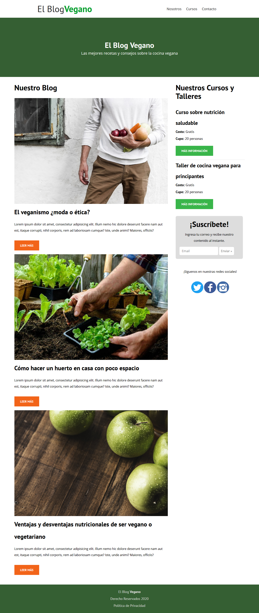

El Blog Vegano 🚀
===========
📋 Realizando una página con HTML y CSS, poniendo en práctica Flexbox y media queries.

## Realizado con 🛠️

* HTML
* CSS

## Autores ✒️
* **Michel Hdez** - (https://github.com/MichelHdez)